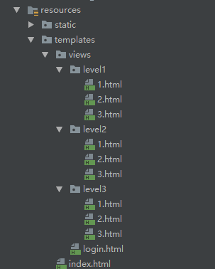
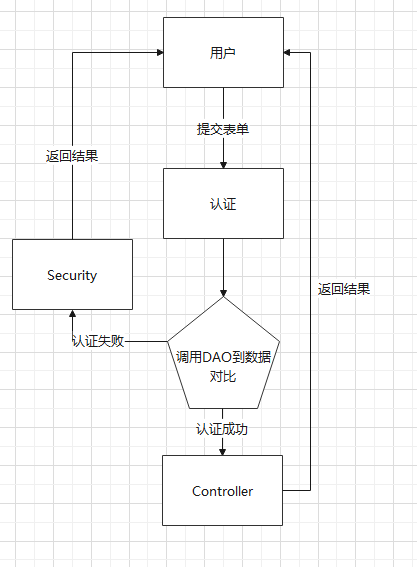
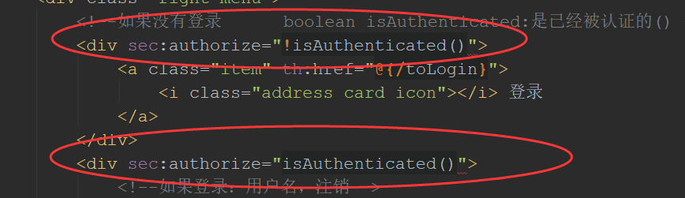

# SpringSecurity
## 1.导入依赖
### 1.1 security--springboot启动
```
<dependency>     
<groupId>org.springframework.security</groupId> 
<artifactId>spring-security-test</artifactId>   
<scope>test</scope>
</dependency>
```  

### 1.2security与thymeleaf整合
```
<dependency>
<groupId>org.springframework.boot</groupId> 
<artifactId>spring-boot-starter-security</artifactId>
</dependency>

````

## 2 准备好html'页面和Controller


```
@RequestMapping("level1/{id}")
public String level1(@PathVariable int id){
    return "views/level1/"+id;
}
@RequestMapping("level2/{id}")
public String level2(@PathVariable int id){
    return "views/level2/"+id;
}
@RequestMapping("level3/{id}")
public String level3(@PathVariable int id){
    return "views/level3/"+id;
}
```

## 3.编写SecurityConfig

### 3.1 继承WebSecurityConfigurerAdapter

```
public class SecurityConfig extends WebSecurityConfigurerAdapter{
}

```
WebSecurityConfigurerAdapter是WebSecurity适配器，自动帮我们配置Security，重写调用configure()方法进行认证和授权

### 3.2 @EnableWebSecurity

@EnableWebSecurity 开启Springboot的Security功能

### 3.3 认证
### 3.3.1 AuthenticationManagerBuilder

AuthenticationManagerBuilder是自定义认证的载体

### 3.4 授权
授权的载体是 HttpSecurity  

额外包含 login、logout、RememberMe 功能


## 4.thmeleaf 结合 Security
#### 在html中导入提示依赖
```
<html lang="en" 
xmlns="http://www.w3.org/1999/xhtml" 
xmlns:th="http://www.thymeleaf.org"      
xmlns:sec="http://www.thymeleaf.org/extras/spring-security">

```
#### 调用方法



